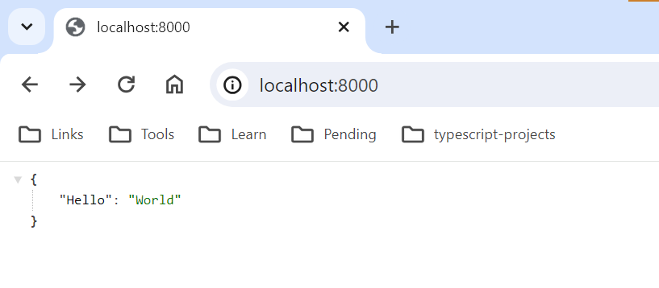
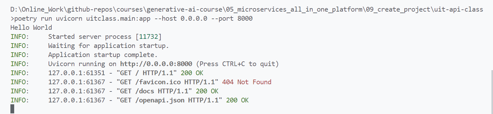

# FastAPI Hello World Project

## Details

### Reference

learn-generative-ai/05_microservices_all_in_one_platform
/09_create_project/

### Technologies used

#### Dependencies

python, fastapi, uvicorn

## Getting Started

### Pre-requisites

python, poetry, code editor like VSCode.

### Install project dependencies

```bash
poetry install
```

### Run development server

#### Run project in Poetry Environment

```bash
poetry run uvicorn uitclass.main:app --host 0.0.0.0 --port 8000
```

Open in Browser [http://localhost:8000](http://localhost:8000).

## Screenshots



