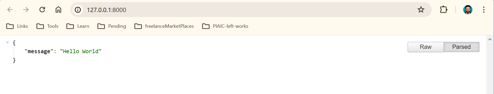
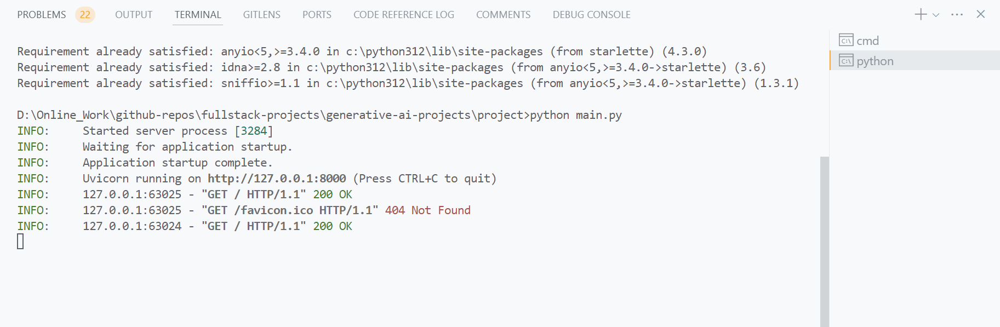

# A simple Starlette application

This is a simple Python web application built using the Starlette framework and Uvicorn server.

## Technologies used

### Dependencies

starlette, uvicorn, JSONResponse

## Getting started

### Pre-requisites

python, pip, starlette, uvicorn, code editor like VSCode.

### Install project dependencies

```bash
pip install uvicorn starlette
```

### Run development server

type the following command in the terminal:

```bash
python main.py
```

Open in Browser [http://127.0.0.1:8000](http://127.0.0.1:8000).

## Screenshots




