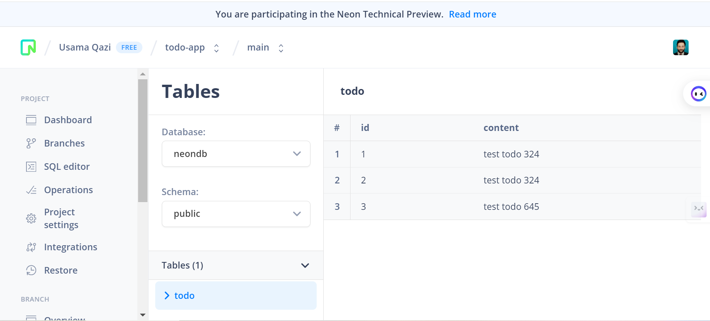

# FastAPI App with PostgresSQL and SQLModel

## Details

Deploy a Serverless FastAPI App with Neon PostgresSQL

### Reference

learn-generative-ai/05_microservices_all_in_one_platform
/11_microservice_db/

### Technologies used

#### Dependencies

python, fastapi, uvicorn, sqlmodel, psycopg

#### Dev dependencies

pytest

## Getting Started

### Pre-requisites

python, ngrok, poetry, account & project setup in neon db, code editor like VSCode.

### Install project dependencies

```bash
poetry install
```

### Run development server

#### Run project in Poetry Environment

```bash
poetry run uvicorn fastapi_neon.main:app --host 0.0.0.0 --port 8000
```

Open in Browser [http://localhost:8000](http://localhost:8000).

Open Docs in Browser [http://localhost:8000/docs](http://localhost:8000/docs).

Open OpenAPI specs in Browser [http://localhost:8000/openapi.json](http://localhost:8000/openapi.json).

#### Deploy with your static domain

```bash
ngrok http --domain=mammoth-touched-halibut.ngrok-free.app 8000
```

Open in Browser [https://mammoth-touched-halibut.ngrok-free.app](https://mammoth-touched-halibut.ngrok-free.app).

Open Docs in Browser [https://mammoth-touched-halibut.ngrok-free.app/docs](https://mammoth-touched-halibut.ngrok-free.app/docs).


Open OpenAPI specs in Browser [https://mammoth-touched-halibut.ngrok-free.app/openapi.json](https://mammoth-touched-halibut.ngrok-free.app/openapi.json)


#### NeonDB


