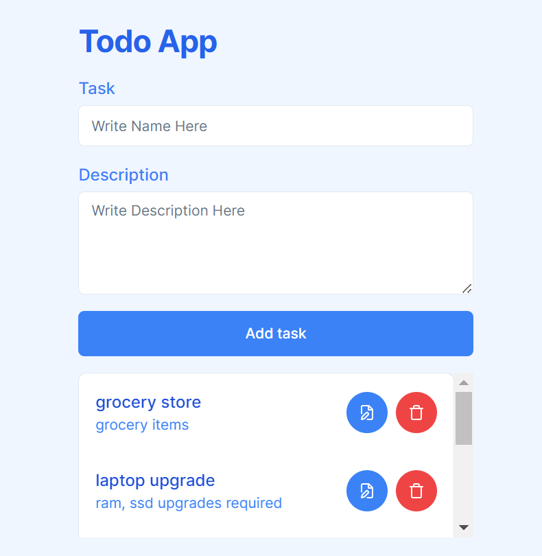
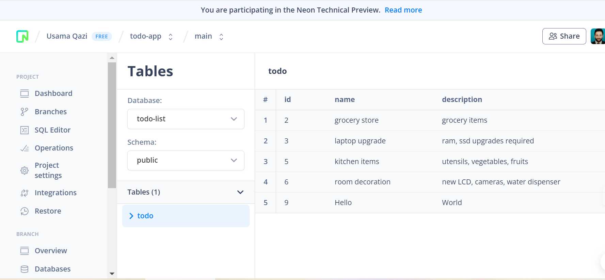
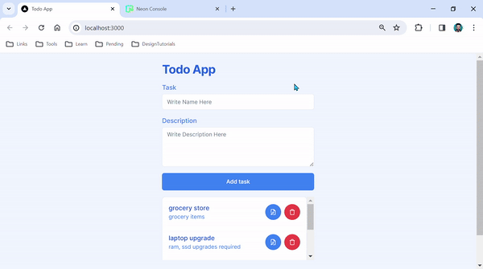

# Todo list NextJS App

## Details

### Brief description

This is a [Next.js](https://nextjs.org/) project bootstrapped with [`create-next-app`](https://github.com/vercel/next.js/tree/canary/packages/create-next-app).

A CRUD Todo list NextJS App with Neon PostgresSQL

### Technologies used

#### Dependencies

react, next.js, axios, lucide-react

#### Dev dependencies

typescript, tailwindcss

## Getting Started

### Pre-requisites

Node.js, NPM, code editor like VSCode.

### Install project dependencies

```bash
npm install
```

### Run development server

```bash
npm run dev
```

Open [http://localhost:3000](http://localhost:3000) with your browser to see the result.

## Screenshots




