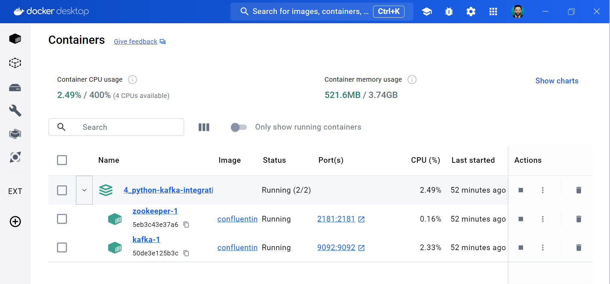
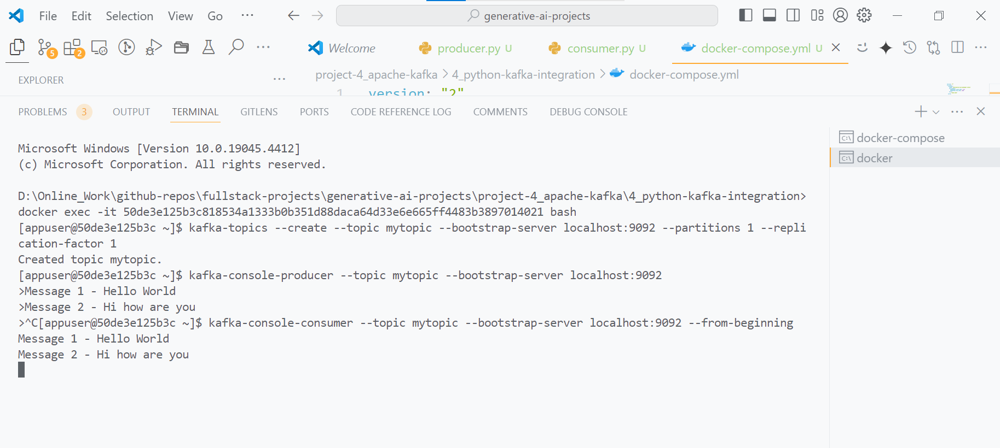
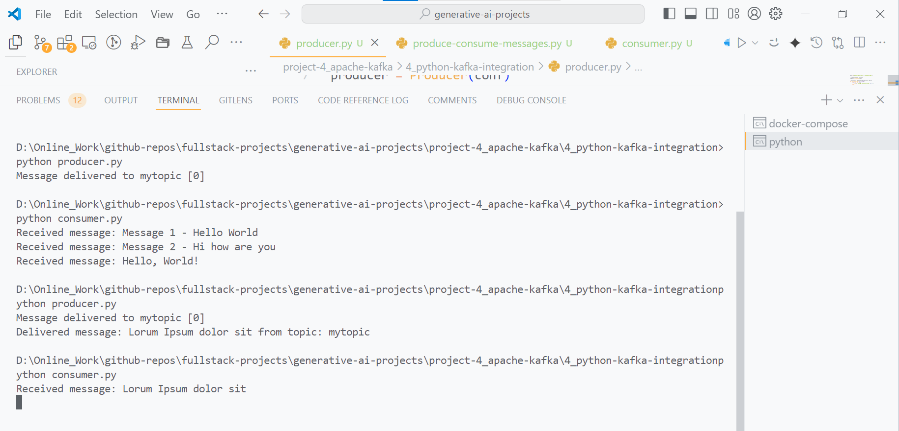

# Python Kafka Integration using Dockers

## Description

This project is a simple example of how to integrate Python with Kafka using Docker containers. The project is divided into two parts: the producer and the consumer. The producer sends messages to the Kafka topic and the consumer reads the messages from the topic.

## Getting Started

### Pre-requisites

python, docker, pip

### How to run

1. Run docker desktop application to start docker daemon.

2. Install confluent_kafka & kafka-python packages:

```bash
pip install confluent-kafka kafka-python
```

3. Run Docker Compose:

```bash
docker-compose up
```

4. Interacting with Kafka using terminal commands:

```sh
# Verify Kafka and Zookeeper containers are running
# Copy docker container id and then replace <kafka_container_id> with the actual container ID of the Kafka container.
docker ps

# Open a bash shell in the Kafka container
docker exec -it <kafka_container_id> bash

# Inside the container, create a topic
kafka-topics --create --topic mytopic --bootstrap-server localhost:9092 --partitions 1 --replication-factor 1

# Produce a message to the topic
kafka-console-producer --topic mytopic --bootstrap-server localhost:9092
> my message (type this and press Enter)

# Consume messages from the topic
kafka-console-consumer --topic mytopic --bootstrap-server localhost:9092 --from-beginning
```

5. Interacting with Kafka using python scripts:

```sh
# Run the producer to produce the message:
python producer.py

# Run the consumer to read the produced message:
python consumer.py
```

## Screenshots






