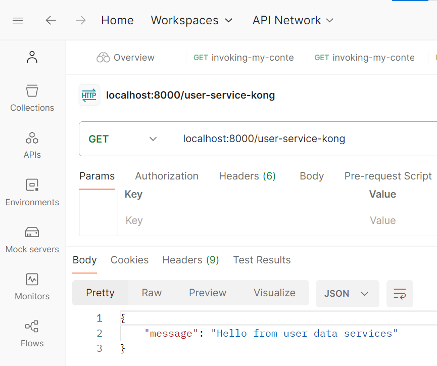
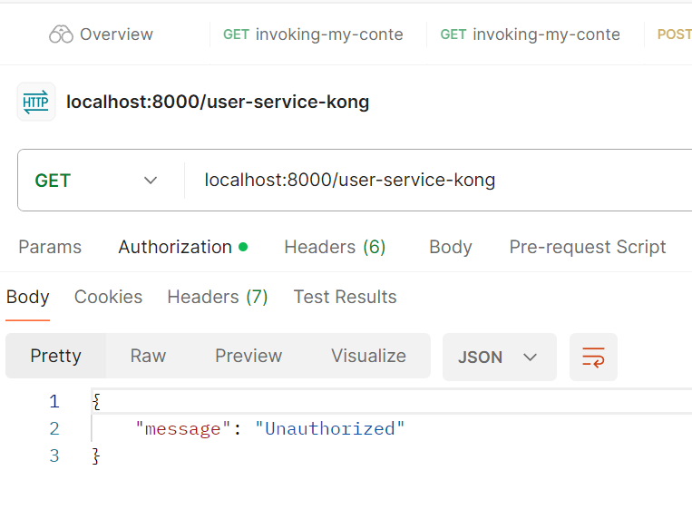
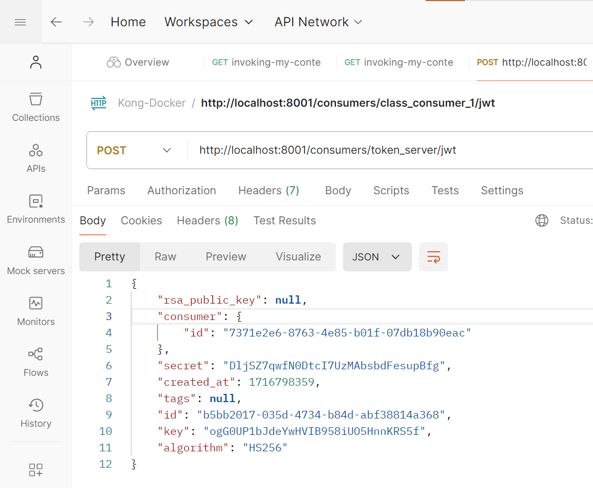
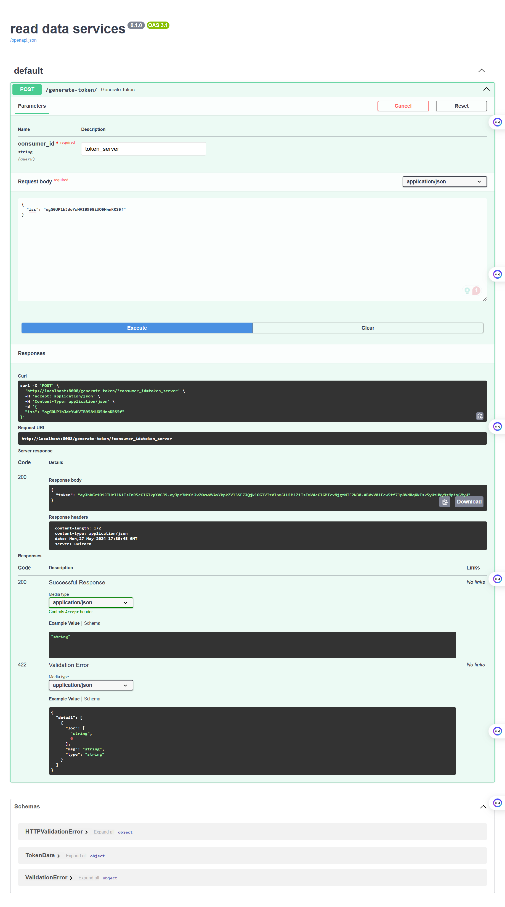
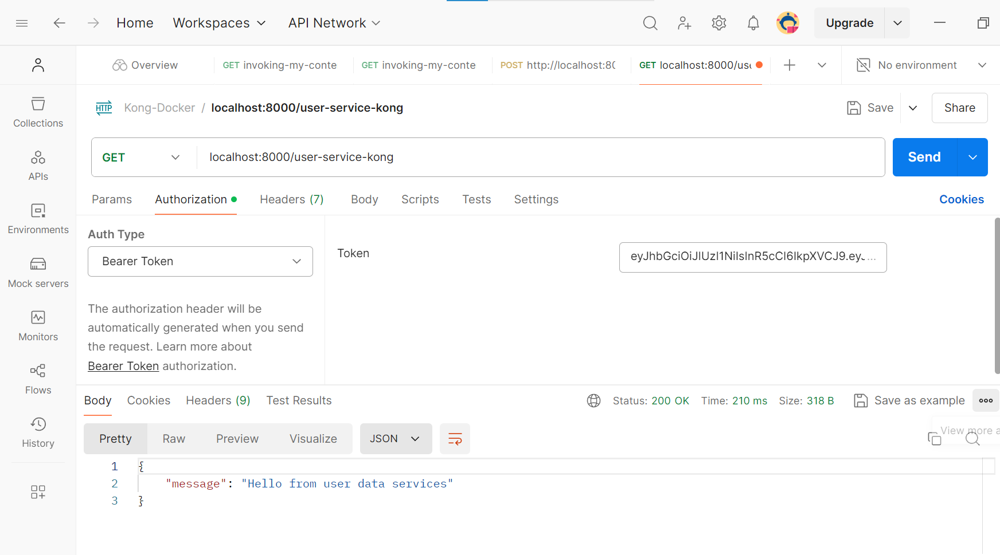

# Kong JWT token validation

## Start docker service

```bash
docker compose --profile database up --build
```

## Check route



## Check route after adding jwt plugin



## Generate credentials



## Generate token



## Check route with token


