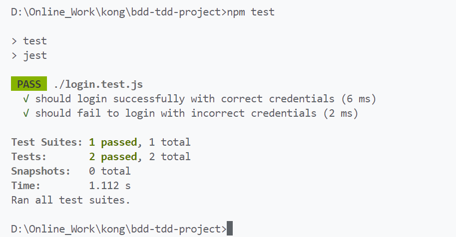

# Scenario: Successful Login

The login.test.js file uses Test-Driven Development (TDD) principles and the Jest testing framework to validate the functionality of a login system, ensuring correct handling of both successful and failed login attempts.

